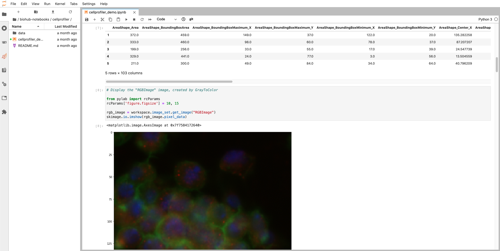
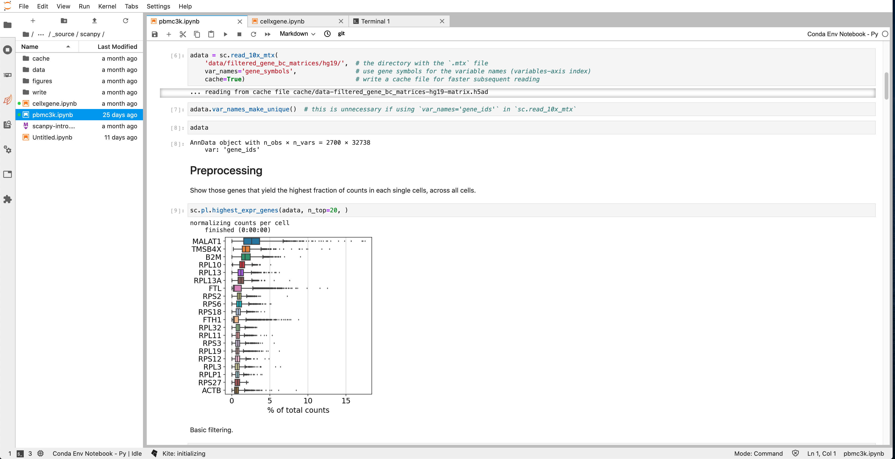
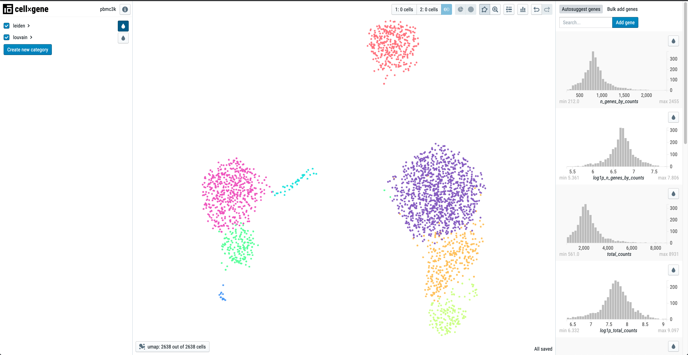
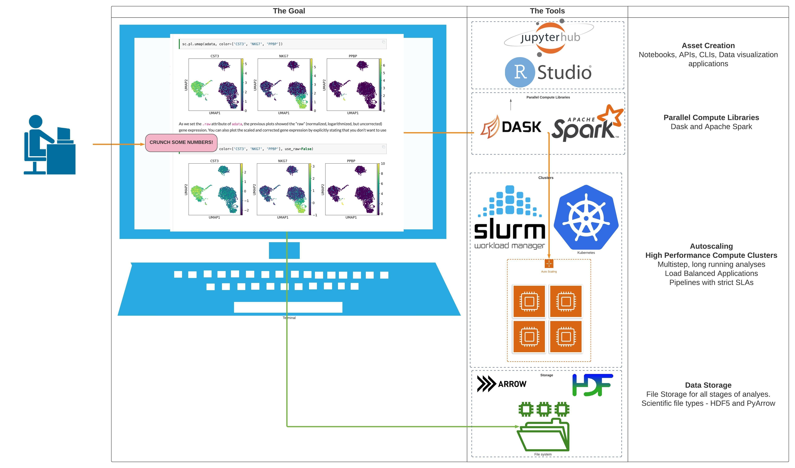

# README

This Github repo houses recipes for Bioinformatics software stacks. Each image can be used on it's own or as a part of a Jupyterhub Cluster.

Each image is meant to be a full fledged ecosystem for Bioinformatics. Along with the listed software each image has Jupyterhub and RStudio along with packages for data science such as Pandas, SciKit Learn, Tidyverse, and documentation packages such as [Jupyterbook](https://jupyterbook.org/) and [RBookdown](https://bookdown.org/). 

[Bioinformatics Ecosystem](./docs/_source/_static/images/BioHub-Ecosystem-IDEs-and-Development-Environment.jpeg)

See each of the images at [Dockerhub](https://hub.docker.com/orgs/dabbleofdevops/repositories).

| Name | Pangeo Versions | Description | Dockerhub URL |
| --- | ----------- | ---------- | --------------- |
| CellProfiler v3 | 2020-12-22, 2020-11-06 | [CellProfiler V3](https://cellprofiler.org/) Free open-source software for measuring and analyzing cell images. | [Dockerhub](https://hub.docker.com/repository/docker/dabbleofdevops/cellprofiler-notebook) |
| Scanpy 1.6.0 | 2020-12-22, 2020-11-06 | [Scanpy 1.6.0](https://scanpy.readthedocs.io/en/stable/) - Single Cell Analysis in Python Scanpy is a scalable toolkit for analyzing single-cell gene expression data built jointly with anndata. It includes preprocessing, visualization, clustering, trajectory inference and differential expression testing. The Python-based implementation efficiently deals with datasets of more than one million cells. This image also includes [CellxGene](https://github.com/chanzuckerberg/cellxgene), an interactive explorer for single-cell transcriptomics data. | [Dockerhub](ihttps://hub.docker.com/repository/docker/dabbleofdevops/scanpy-notebook) |
| Napari v0.4.2 | 2020-12-22, 2020-11-06 | [Napari v0.4.2](https://napari.org/) a fast, interactive, multi-dimensional image viewer for python | [Dockerhub](https://hub.docker.com/repository/docker/dabbleofdevops/napari-notebook) |
| Seurat v4.0.0 | 2020-12-22, 2020-11-06 | [Seurat v4.0.0.0](https://satijalab.org/seurat/) R Toolkit for Single Cell Genomics | [Dockerhub](https://hub.docker.com/repository/docker/dabbleofdevops/seurat-notebook)  |
| Genomics | 2020-12-22, 2020-11-06 | A bioinformatics environment for Genomics with Python, R v4.0.3, Pandas, Tidyverse, [Plink](https://zzz.bwh.harvard.edu/plink/), Plink2, [Hail](https://hail.is/index.html), and [PheWeb](https://github.com/statgen/pheweb)  | [Dockerhub](https://hub.docker.com/repository/docker/dabbleofdevops/genomics-notebook) |
| Conda R 4.0.3 | 2020-12-22, 2020-11-06 | A base environment for R v4.0.3 environments built with Conda. | [Dockerhub](https://hub.docker.com/repository/docker/dabbleofdevops/conda-r-4.0.3-notebook) |
| Conda R 3.6.1 | 2020-12-22, 2020-11-06 | A base environment for R v3.6.1 environments built with Conda. | [Dockerhub](https://hub.docker.com/repository/docker/dabbleofdevops/conda-r-3.6.1-notebook)  |

Read more on the (WIP) [docs](https://jhubdockerdocs.dabbleofdevopsonaws.com/) site.

## CellProfiler 

## Scanpy

## The Goal

Empower all Bioinformaticians to deploy cool stuff.

## Acknowledgements

This project was very heavily inspired by the [Pangeo Docker Images Repo](https://github.com/pangeo-data/pangeo-docker-images).

This project, and several of the software stacks, are in collaboration with [STEMAway.](https://stemaway.com/) 
